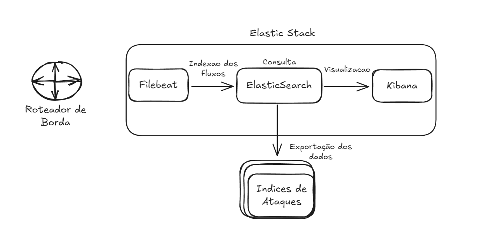
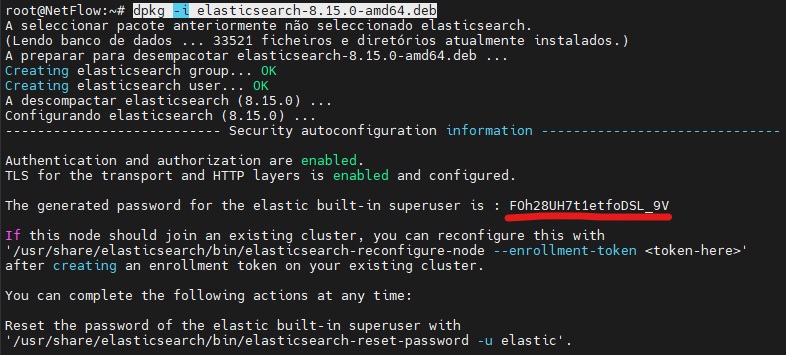
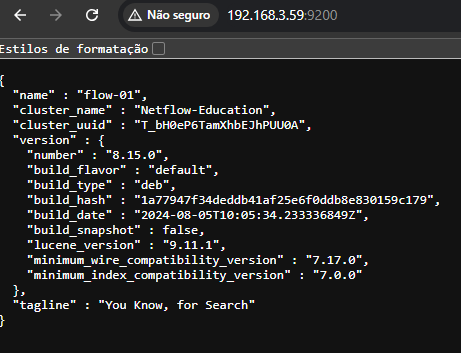
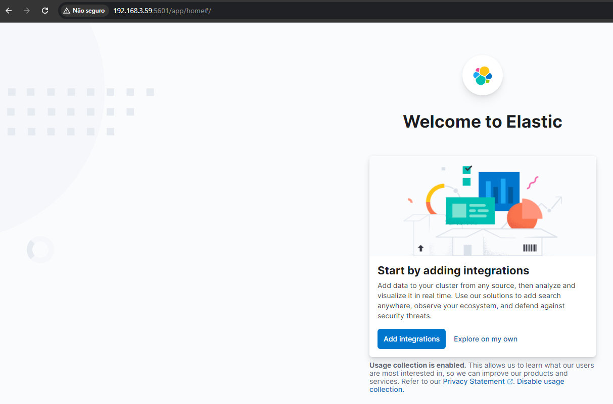
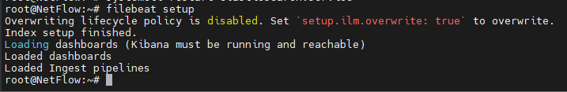
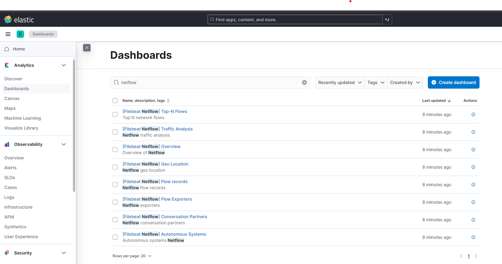
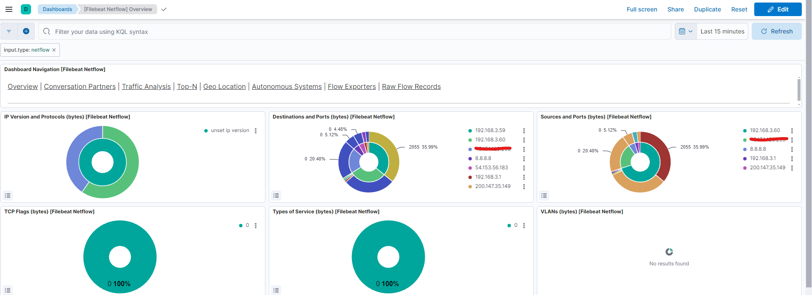

# Ambiente para Monitoramento NetFlow

Neste ambiente, configuraremos o monitoramento de NetFlow. No roteador, switch ou equipamento de preferência na borda, configuraremos para enviar os fluxos de rede para um servidor onde o Elasticsearch foi instalado. Este servidor deve ter os seguintes serviços em execução:

* FileBeat
* Elasticsearch
* Kibana



## 1 - Baixar ISO do Debian

Utilizamos a versão do Debian 12 neste tutorial.

[ISO DEBIAN](https://www.debian.org/CD/http-ftp/)

## Requisitos do Sistema

Para uma base de teste, recomendamos os seguintes requisitos:

* 2 CPUs
* 4 GB RAM
* 40 GB de disco

## Instalação do Debian

1. Instale o Debian sem interface gráfica.
2. Habilite o acesso SSH.

## Instalação dos Serviços

Com a máquina (VM) já criada, vamos iniciar a instalação dos serviços. É importante manter todos os serviços na mesma versão para garantir compatibilidade.

### Instale as Bibliotecas Globais

Instale algumas dependências essenciais. Verifique se o relógio do servidor está sincronizado com o horário dos seus equipamentos de rede.

```bash
apt update
apt upgrade
apt -y install wget ntp apt-transport-https gnupg unzip curl net-tools default-jre tcpdump
```
# Instalando elastic search
Voce pode querer baixar a versao mais atual do ElastichSearch, para isso pode acessar a seguinte pagina: https://www.elastic.co/pt/downloads/elasticsearch e selecionar a opcao apt-get em Packege managers

```bash
wget https://artifacts.elastic.co/downloads/elasticsearch/elasticsearch-8.15.1-amd64.deb
wget https://artifacts.elastic.co/downloads/elasticsearch/elasticsearch-8.15.1-amd64.deb.sha512
shasum -a 512 -c elasticsearch-8.15.1-amd64.deb.sha512 
sudo dpkg -i elasticsearch-8.15.1-amd64.deb
```
Quando descompactar o o elatichsearch, o mesmo vai informar uma senha para voce, guarde ela, pois iremos utilizar depois.



> Caso o comando `shasum` nao seja encontrado, sera preciso instalar o `perl` com o comando `apt install perl`.

### Alguns comandos interessantes do elatichSearch
```bash
If this node should join an existing cluster, you can reconfigure this with
'/usr/share/elasticsearch/bin/elasticsearch-reconfigure-node --enrollment-token <token-here>'
after creating an enrollment token on your existing cluster.

You can complete the following actions at any time:

Reset the password of the elastic built-in superuser with
'/usr/share/elasticsearch/bin/elasticsearch-reset-password -u elastic'.

Generate an enrollment token for Kibana instances with
 '/usr/share/elasticsearch/bin/elasticsearch-create-enrollment-token -s kibana'.

Generate an enrollment token for Elasticsearch nodes with
'/usr/share/elasticsearch/bin/elasticsearch-create-enrollment-token -s node
```

### Iniciando serviços

```bash
systemctl daemon-reload
systemctl enable elasticsearch.service
systemctl start elasticsearch.service
systemctl status elasticsearch.service
curl -X GET 127.0.0.1:9200
```
> Nesse momento o elastichsearch ja deve esta rodando.

## Configuracoes do ElastichSearch
Agora vamos editar o arquivo de configuração e Alterar as opções abaixo no arquivo `/etc/elasticsearch/elasticsearch.yml`

1. Diretorio
`nano /etc/elasticsearch/elasticsearch.yml`

```bash
cluster.name: Netflow-Education
node.name: flow-01
network.host: IP DO SERVIDOR
http.port: 9200
# Enable security feactures
xpack.security.enabled: false
xpack.security.enrollment.enabled: false
xpack.security.http.ssl:
enabled: false
xpack.security.transport.ssl:
enabled: false
```
### Iniciando serviços
```bash
systemctl daemon-reload
systemctl restart elasticsearch.service
systemctl enable elasticsearch.service
```
### Testar acessar na WEB
Agora com a configuracao feita no ElastichSearch, podemos testar o acesso da pagina web



# Instalacao do KIBANA
> Interface grafica para gerenciar o banco de dados e tambem graficos para visualizar.

Pagina oficial do KIBANA onde e possivel baixar a versao mais atual: https://www.elastic.co/pt/downloads/kibana

```bash
wget https://artifacts.elastic.co/downloads/kibana/kibana-8.15.1-amd64.deb
shasum -a 512 kibana-8.15.1-amd64.deb 
```

## Acessar arquivo de configuração do Kibana

* Diretorio de configuracao: `nano /etc/kibana/kibana.yml`
```bash
# server.port: 5601
# server.host: "IP DO SERVIDOR"
# server.name: "kibana-flow"
# elasticsearch.hosts: ["http://IP DO SERVIDOR:9200"]
```


### Restart serviços
```bash
systemctl enable kibana.service
systemctl start kibana.service
systemctl status kibana.service
tail -f /var/log/kibana/kibana.log -n 1000
```

### Acessar na WEB o KIBANA
http://IP SERVIDOR:5601/



> Selecione a opcao " Explore on my own "


# Instalacao FILEBEAT
Aplicacao responsavel por receber o fluxo dos equipamentos.

Pagina oficial para download: https://www.elastic.co/pt/downloads/beats/filebeat

```bash
wget https://artifacts.elastic.co/downloads/beats/filebeat/filebeat-8.15.1-amd64.deb
wget https://artifacts.elastic.co/downloads/beats/filebeat/filebeat-8.15.1-amd64.deb.sha512
shasum -a 512 -c filebeat-8.15.1-amd64.deb.sha512
dpkg -i filebeat-8.15.1-amd64.deb
```

## Configuracao FILEBEAT
* Diretorio: `/etc/filebeat/filebeat.yml`

> Ajustar os enderecos IPS que o FILEBEAT vai se comunicar
```bash
output.elasticsearch:
 #Array of hosts to connect to.
hosts: ["IP SERVIDOR:9200"]
 #Kibana Host
host: "IP SERVIDOR:5601"
```

### Listar modulos do beats e habilitar

```bash
filebeat modules list
filebeat modules enable netflow
```

### acessar arquivo de configuração netflow alterar endereço ip de escuta.
* Diretorio: `/etc/filebeat/modules.d/netflow.yml`

```bash
- module: netflow
  log:
    enabled: true
    var:
      netflow_host: IP SERVIDOR
      netflow_port: 2055
```

### restart serviços
```bash
systemctl enable filebeat
service filebeat start
filebeat setup
systemctl restart elasticsearch.service
```

> filebeat setup, ja configura dashboards automaticamente para fluxos de netflow.


# Download Mikrotik
> Para testar se a coleta de flow esta funcionando, vamos utilizar um concentrador mikrotik.

Pagina para download: https://mikrotik.com/download
* Selecionar a opacao: Cloud Hosted Router
* Images: OVA image - Long-Term
* Descompacte o arquivo baixado do mikrotik e suba no virtual-box
* Usuario e senha de acesso:
    * Login: admin
    * Password: "nao tem senha, so da entender"

```bash
/ip traffic-flow
set cache-entries=1k enabled=yes interfaces=local
/ip traffic-flow target
add dst-address=IP SERVIDOR ELASTICH
```
> Nesse momento gere algum trafego no mikrotik, e ele sera enviado para o servidor de flow.


# DASHBOARD KIBANA
No kibana, nas dashboards, selecione alguns tipos de dashboard para netflow e o sistema montara os graficos.



Selecionando uma dashboard, termos algo parecido com isso:


